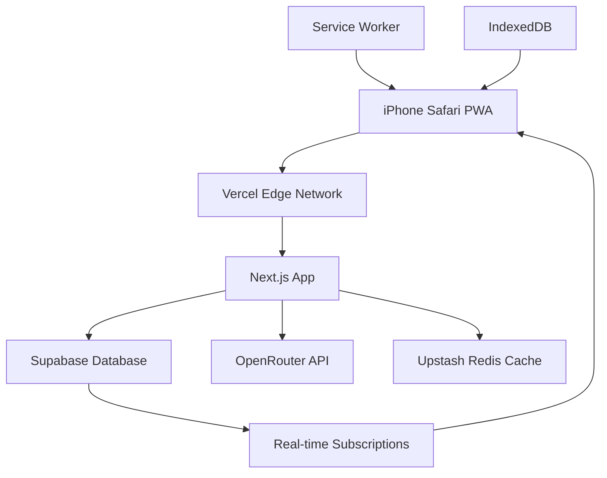
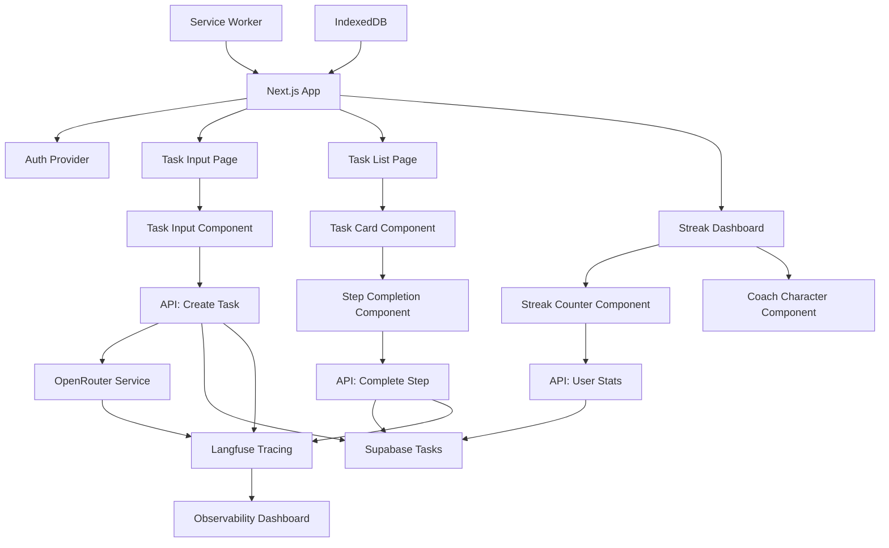
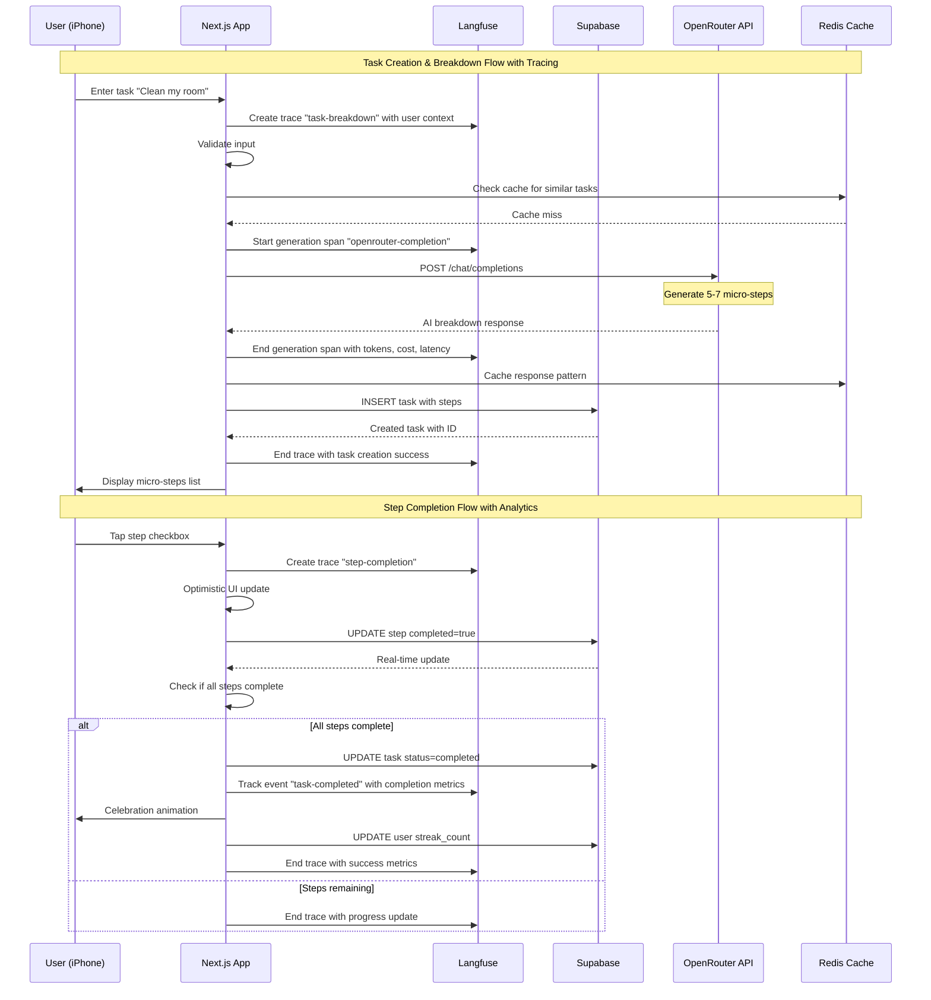
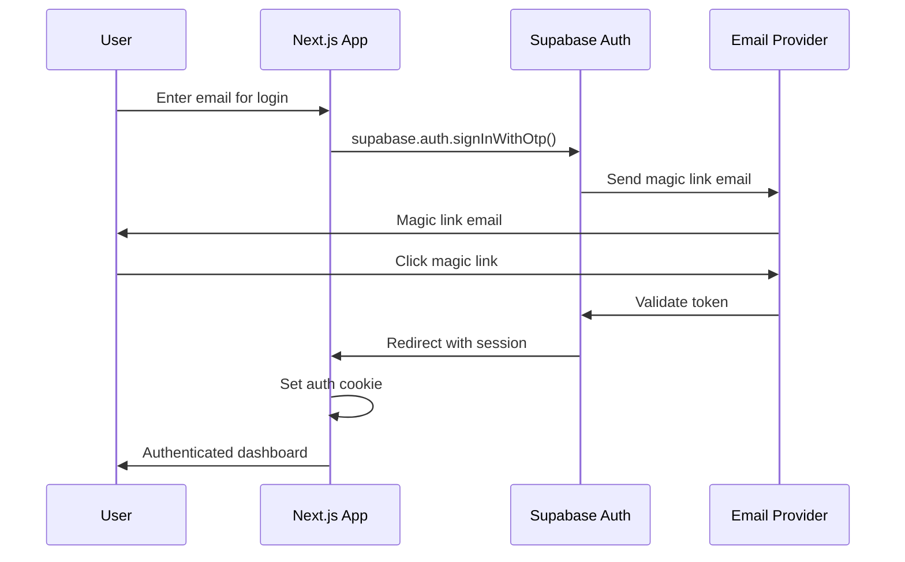
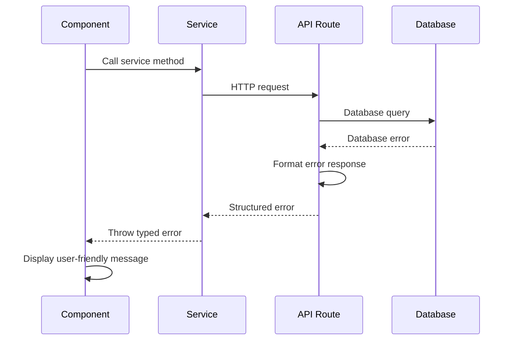

# Routiny Fullstack Architecture Document

This document outlines the complete fullstack architecture for **Routiny**, including backend systems, frontend implementation, and their integration. It serves as the single source of truth for AI-driven development, ensuring consistency across the entire technology stack.

This unified approach combines what would traditionally be separate backend and frontend architecture documents, streamlining the development process for modern fullstack applications where these concerns are increasingly intertwined.

## Starter Template or Existing Project

**T3 Stack (create-t3-app)** - The cleanest possible starting point for your first full-stack app:

- ✅ Next.js 14 + TypeScript pre-configured
- ✅ Tailwind CSS ready to go
- ✅ ESLint/Prettier setup
- ✅ Simple, opinionated structure
- ✅ Perfect for learning full-stack development

**Rationale:** T3 Stack eliminates all configuration complexity while remaining educational and production-ready.

## Change Log

| Date       | Version | Description                  | Author              |
| ---------- | ------- | ---------------------------- | ------------------- |
| 2025-09-06 | 1.0     | Initial architecture for MVP | Winston (Architect) |

## High Level Architecture

### Technical Summary

Routiny uses a **serverless-first Next.js monolith** deployed on Vercel with Supabase as the complete backend service. The frontend leverages React 18 with TypeScript for type safety and Tailwind CSS for rapid UI development. API routes handle OpenRouter integration for task breakdown while Supabase provides authentication, real-time database, and offline sync. This architecture prioritizes developer experience and deployment simplicity over complex microservices, making it perfect for MVP development and learning.

### Platform and Infrastructure Choice

**Platform:** Vercel + Supabase
**Key Services:**

- Vercel (hosting, edge functions, deployments)
- Supabase (auth, database, real-time sync)
- OpenRouter API (task breakdown - access to multiple AI models)
- Upstash Redis (API response caching)

**Deployment Host and Regions:** Global edge network via Vercel with primary database in US-East

### Repository Structure

**Structure:** Monorepo with Next.js App Router
**Monorepo Tool:** Not needed - simple Next.js project structure
**Package Organization:** Single app with clear folder separation by feature

### High Level Architecture Diagram



### Architectural Patterns

- **Jamstack Architecture:** Static-first with serverless APIs - _Rationale:_ Maximum performance and simplicity for MVP
- **Component-Based UI:** Reusable React components with TypeScript - _Rationale:_ Maintainability and learning experience
- **Repository Pattern:** Abstract Supabase interactions - _Rationale:_ Clean separation and testability
- **API-First Design:** All data flows through defined APIs - _Rationale:_ Consistency and offline capability

## Tech Stack

### Technology Stack Table

| Category                | Technology                | Version | Purpose                           | Rationale                                               |
| ----------------------- | ------------------------- | ------- | --------------------------------- | ------------------------------------------------------- |
| Frontend Language       | TypeScript                | 5.0+    | Type-safe frontend development    | Learning industry standard with error prevention        |
| Frontend Framework      | Next.js                   | 14.0+   | React-based fullstack framework   | App Router, server components, built-in optimization    |
| UI Component Library    | Headless UI + Custom      | 2.0+    | Accessible base components        | Lightweight, educational, customizable                  |
| State Management        | Zustand                   | 4.0+    | Client-side state management      | Simple API, perfect for learning                        |
| Backend Language        | TypeScript                | 5.0+    | Server-side logic in API routes   | Shared types with frontend                              |
| Backend Framework       | Next.js API Routes        | 14.0+   | Serverless API endpoints          | No additional backend complexity                        |
| API Style               | REST                      | -       | Simple HTTP endpoints             | Easy to understand and debug                            |
| Database                | Supabase PostgreSQL       | Latest  | Primary data storage              | Full-featured with real-time subscriptions              |
| Cache                   | Upstash Redis             | Latest  | API response caching              | Reduce OpenRouter API costs                             |
| File Storage            | Supabase Storage          | Latest  | User files and assets             | Integrated with auth system                             |
| Authentication          | Supabase Auth             | Latest  | Magic link authentication         | No password complexity                                  |
| Frontend Testing        | Vitest + Testing Library  | Latest  | Component and unit tests          | Fast, modern testing stack                              |
| Backend Testing         | Vitest                    | Latest  | API endpoint testing              | Consistent with frontend                                |
| E2E Testing             | Playwright                | Latest  | Critical user flows               | Industry standard                                       |
| Build Tool              | Next.js built-in          | 14.0+   | Development and production builds | Zero configuration needed                               |
| Bundler                 | Turbopack                 | Latest  | Fast development bundling         | Next.js integrated                                      |
| IaC Tool                | Not needed                | -       | Vercel handles infrastructure     | Simplicity over control                                 |
| CI/CD                   | Vercel Git Integration    | Latest  | Automated deployments             | Zero configuration                                      |
| Monitoring              | Vercel Analytics + Sentry | Latest  | Performance and error tracking    | Built-in + error reporting                              |
| Observability & Tracing | Langfuse                  | Latest  | AI/LLM observability and tracing  | Specialized LLM call tracking, debugging, and analytics |
| Logging                 | Vercel Logs + Console     | Latest  | Application logging               | Simple debugging                                        |
| CSS Framework           | Tailwind CSS              | 3.0+    | Utility-first styling             | Rapid development, mobile-first                         |

## Data Models

### User

**Purpose:** Represents authenticated users with streak and preference data

**Key Attributes:**

- id: string (UUID) - Supabase auth user ID
- email: string - Authentication identifier
- streak_count: number - Current consecutive days
- total_tasks_completed: number - Lifetime task completion count
- preferences: object - UI and notification settings
- created_at: timestamp - Account creation
- last_active: timestamp - Recent activity for streak calculation

#### TypeScript Interface

```typescript
interface User {
  id: string;
  email: string;
  streak_count: number;
  total_tasks_completed: number;
  preferences: UserPreferences;
  created_at: string;
  last_active: string;
}

interface UserPreferences {
  coach_personality: "encouraging" | "neutral" | "playful";
  notification_enabled: boolean;
  theme: "light" | "dark" | "auto";
}
```

#### Relationships

- Has many Tasks (one-to-many)
- Has many TaskSteps through Tasks

### Task

**Purpose:** User-created tasks that get broken down into micro-steps by AI

**Key Attributes:**

- id: string (UUID) - Unique identifier
- user_id: string - Foreign key to User
- title: string - Original task description
- ai_breakdown: string[] - AI-generated micro-steps
- status: enum - pending, in_progress, completed
- completed_at: timestamp - Completion time for streak calculation
- created_at: timestamp - Task creation time

#### TypeScript Interface

```typescript
interface Task {
  id: string;
  user_id: string;
  title: string;
  ai_breakdown: string[];
  status: "pending" | "in_progress" | "completed";
  completed_at: string | null;
  created_at: string;
}
```

#### Relationships

- Belongs to User (many-to-one)
- Has many TaskSteps (one-to-many)

### TaskStep

**Purpose:** Individual micro-steps within a task with completion tracking

**Key Attributes:**

- id: string (UUID) - Unique identifier
- task_id: string - Foreign key to Task
- step_text: string - AI-generated step description
- order_index: number - Step sequence (0-based)
- completed: boolean - Completion status
- completed_at: timestamp - When step was marked complete

#### TypeScript Interface

```typescript
interface TaskStep {
  id: string;
  task_id: string;
  step_text: string;
  order_index: number;
  completed: boolean;
  completed_at: string | null;
}
```

#### Relationships

- Belongs to Task (many-to-one)
- Belongs to User through Task

## API Specification

### REST API Specification

```yaml
openapi: 3.0.0
info:
  title: Routiny API
  version: 1.0.0
  description: Simple REST API for task breakdown and management
servers:
  - url: https://routiny.vercel.app/api
    description: Production API

paths:
  /tasks:
    post:
      summary: Create new task with AI breakdown
      requestBody:
        required: true
        content:
          application/json:
            schema:
              type: object
              properties:
                title:
                  type: string
                  description: User's task description
      responses:
        201:
          description: Task created with AI breakdown
          content:
            application/json:
              schema:
                $ref: "#/components/schemas/Task"
    get:
      summary: Get user's tasks
      parameters:
        - name: status
          in: query
          schema:
            type: string
            enum: [pending, in_progress, completed]
      responses:
        200:
          description: List of tasks
          content:
            application/json:
              schema:
                type: array
                items:
                  $ref: "#/components/schemas/Task"

  /tasks/{id}/steps/{stepId}/complete:
    post:
      summary: Mark task step as complete
      parameters:
        - name: id
          in: path
          required: true
          schema:
            type: string
        - name: stepId
          in: path
          required: true
          schema:
            type: string
      responses:
        200:
          description: Step marked complete
          content:
            application/json:
              schema:
                $ref: "#/components/schemas/TaskStep"

  /user/stats:
    get:
      summary: Get user streak and completion statistics
      responses:
        200:
          description: User statistics
          content:
            application/json:
              schema:
                $ref: "#/components/schemas/UserStats"

  /analytics/langfuse:
    get:
      summary: Get AI/LLM usage analytics and insights
      parameters:
        - name: timeframe
          in: query
          schema:
            type: string
            enum: [1d, 7d, 30d, 90d]
            default: 7d
      responses:
        200:
          description: Langfuse analytics data
          content:
            application/json:
              schema:
                $ref: "#/components/schemas/LangfuseAnalytics"

components:
  schemas:
    Task:
      type: object
      properties:
        id:
          type: string
        user_id:
          type: string
        title:
          type: string
        ai_breakdown:
          type: array
          items:
            type: string
        status:
          type: string
          enum: [pending, in_progress, completed]
        completed_at:
          type: string
          format: date-time
          nullable: true
        created_at:
          type: string
          format: date-time

    TaskStep:
      type: object
      properties:
        id:
          type: string
        task_id:
          type: string
        step_text:
          type: string
        order_index:
          type: number
        completed:
          type: boolean
        completed_at:
          type: string
          format: date-time
          nullable: true

    UserStats:
      type: object
      properties:
        streak_count:
          type: number
        total_tasks_completed:
          type: number
        tasks_this_week:
          type: number

    LangfuseAnalytics:
      type: object
      properties:
        totalTraces:
          type: number
        totalGenerations:
          type: number
        averageTokensPerTask:
          type: number
        totalCost:
          type: number
          format: float
        averageLatency:
          type: number
          format: float
        modelPerformance:
          type: array
          items:
            type: object
            properties:
              model:
                type: string
              successRate:
                type: number
                format: float
              averageLatency:
                type: number
              totalTokens:
                type: number
              cost:
                type: number
                format: float
        userEngagement:
          type: object
          properties:
            averageCompletionRate:
              type: number
              format: float
            averageTimeToComplete:
              type: number
            mostEffectiveBreakdownLength:
              type: number
```

## Components

### Frontend App Component

**Responsibility:** Main React application with routing, auth state, and global providers

**Key Interfaces:**

- Authentication context provider
- Route protection and navigation
- Global state management setup

**Dependencies:** Next.js App Router, Supabase client, Zustand stores

**Technology Stack:** Next.js 14 App Router, TypeScript, Tailwind CSS

### Task Input Component

**Responsibility:** Text input interface for task creation with voice input support (future)

**Key Interfaces:**

- Task creation form with validation
- Loading states during AI processing
- Error handling and retry logic

**Dependencies:** OpenRouter API service, form validation library

**Technology Stack:** React components, Headless UI, form libraries

### Task Breakdown Display Component

**Responsibility:** Shows AI-generated micro-steps with interactive completion checkboxes

**Key Interfaces:**

- Step completion tracking
- Progress visualization
- Coach character integration

**Dependencies:** Task step data, completion API, animation library

**Technology Stack:** React, CSS animations, Tailwind

### Coach Character Component

**Responsibility:** Pixel-art companion providing encouragement and celebrations

**Key Interfaces:**

- State-based animations (idle, encouraging, celebrating)
- Context-aware messaging
- Celebration triggers

**Dependencies:** User progress data, animation assets

**Technology Stack:** CSS animations, SVG/pixel art assets

### API Route Handlers

**Responsibility:** Serverless functions handling OpenRouter integration, data persistence, auth

**Key Interfaces:**

- RESTful endpoints for CRUD operations
- OpenRouter API proxy with caching
- Authentication middleware

**Dependencies:** Supabase client, OpenRouter SDK, Redis cache

**Technology Stack:** Next.js API routes, TypeScript, serverless runtime

### Supabase Service Layer

**Responsibility:** Abstract database operations and real-time subscriptions

**Key Interfaces:**

- Repository pattern for data access
- Real-time change subscriptions
- Offline sync support

**Dependencies:** Supabase JavaScript client

**Technology Stack:** Supabase client libraries, PostgreSQL

### Langfuse Observability Service

**Responsibility:** Comprehensive AI/LLM call tracing, analytics, and debugging

**Key Interfaces:**

- Trace creation and lifecycle management
- Generation tracking with input/output capture
- Cost and performance metrics collection
- Real-time debugging and error tracking

**Dependencies:** Langfuse SDK, OpenRouter API responses, user session data

**Technology Stack:** Langfuse TypeScript SDK, observability dashboard

### Component Diagrams



## External APIs

### OpenRouter API

- **Purpose:** AI-powered task breakdown into 5-7 micro-steps using multiple AI models
- **Documentation:** https://openrouter.ai/docs
- **Base URL(s):** https://openrouter.ai/api/v1
- **Authentication:** Bearer token (API key)
- **Rate Limits:** Varies by model, generally more flexible than direct provider access

**Key Endpoints Used:**

- `POST /chat/completions` - Generate task breakdown with structured prompts

**Integration Notes:** Access to multiple models (GPT-4, Claude, Llama, etc.), implement response caching to reduce costs, fallback to different models if one fails, streaming disabled for simplicity

## Core Workflows



## Database Schema

```sql
-- Enable UUID extension
CREATE EXTENSION IF NOT EXISTS "uuid-ossp";

-- Users table (extends Supabase auth.users)
CREATE TABLE public.users (
    id UUID REFERENCES auth.users PRIMARY KEY,
    email TEXT NOT NULL,
    streak_count INTEGER DEFAULT 0,
    total_tasks_completed INTEGER DEFAULT 0,
    preferences JSONB DEFAULT '{"coach_personality": "encouraging", "notification_enabled": true, "theme": "auto"}'::jsonb,
    created_at TIMESTAMP WITH TIME ZONE DEFAULT NOW(),
    last_active TIMESTAMP WITH TIME ZONE DEFAULT NOW()
);

-- Tasks table
CREATE TABLE public.tasks (
    id UUID DEFAULT uuid_generate_v4() PRIMARY KEY,
    user_id UUID REFERENCES public.users(id) ON DELETE CASCADE,
    title TEXT NOT NULL,
    ai_breakdown TEXT[] NOT NULL,
    status TEXT CHECK (status IN ('pending', 'in_progress', 'completed')) DEFAULT 'pending',
    completed_at TIMESTAMP WITH TIME ZONE NULL,
    created_at TIMESTAMP WITH TIME ZONE DEFAULT NOW()
);

-- Task steps table
CREATE TABLE public.task_steps (
    id UUID DEFAULT uuid_generate_v4() PRIMARY KEY,
    task_id UUID REFERENCES public.tasks(id) ON DELETE CASCADE,
    step_text TEXT NOT NULL,
    order_index INTEGER NOT NULL,
    completed BOOLEAN DEFAULT FALSE,
    completed_at TIMESTAMP WITH TIME ZONE NULL,
    UNIQUE(task_id, order_index)
);

-- Indexes for performance
CREATE INDEX idx_tasks_user_id ON public.tasks(user_id);
CREATE INDEX idx_tasks_status ON public.tasks(status);
CREATE INDEX idx_task_steps_task_id ON public.task_steps(task_id);
CREATE INDEX idx_users_last_active ON public.users(last_active);

-- Row Level Security (RLS) policies
ALTER TABLE public.users ENABLE ROW LEVEL SECURITY;
ALTER TABLE public.tasks ENABLE ROW LEVEL SECURITY;
ALTER TABLE public.task_steps ENABLE ROW LEVEL SECURITY;

-- Users can only see/edit their own data
CREATE POLICY "Users can view own data" ON public.users
    FOR ALL USING (auth.uid() = id);

CREATE POLICY "Users can manage own tasks" ON public.tasks
    FOR ALL USING (auth.uid() = user_id);

CREATE POLICY "Users can manage own task steps" ON public.task_steps
    FOR ALL USING (auth.uid() IN (
        SELECT user_id FROM public.tasks WHERE id = task_steps.task_id
    ));
```

## Frontend Architecture

### Component Architecture

#### Component Organization

```
src/
├── components/
│   ├── ui/              # Headless UI + custom base components
│   │   ├── Button.tsx
│   │   ├── Input.tsx
│   │   └── Card.tsx
│   ├── task/            # Task-related components
│   │   ├── TaskInput.tsx
│   │   ├── TaskCard.tsx
│   │   ├── StepList.tsx
│   │   └── StepItem.tsx
│   ├── coach/           # Coach character components
│   │   ├── CoachAvatar.tsx
│   │   └── CoachMessage.tsx
│   └── layout/          # Layout components
│       ├── Header.tsx
│       ├── Navigation.tsx
│       └── PWAPrompt.tsx
├── hooks/               # Custom React hooks
│   ├── useAuth.ts
│   ├── useTasks.ts
│   └── useOffline.ts
└── stores/              # Zustand state stores
    ├── authStore.ts
    ├── taskStore.ts
    └── uiStore.ts
```

#### Component Template

```typescript
import { FC, ReactNode } from 'react';
import { cn } from '@/lib/utils';

interface ComponentProps {
  children?: ReactNode;
  className?: string;
  // Add specific props here
}

const Component: FC<ComponentProps> = ({
  children,
  className,
  ...props
}) => {
  return (
    <div className={cn("default-styles", className)} {...props}>
      {children}
    </div>
  );
};

export default Component;
```

### State Management Architecture

#### State Structure

```typescript
// Auth Store
interface AuthState {
  user: User | null;
  session: Session | null;
  loading: boolean;
  signIn: (email: string) => Promise<void>;
  signOut: () => Promise<void>;
  updatePreferences: (prefs: Partial<UserPreferences>) => Promise<void>;
}

// Task Store
interface TaskState {
  tasks: Task[];
  currentTask: Task | null;
  loading: boolean;
  createTask: (title: string) => Promise<Task>;
  completeStep: (taskId: string, stepIndex: number) => Promise<void>;
  fetchTasks: () => Promise<void>;
}

// UI Store
interface UIState {
  sidebarOpen: boolean;
  theme: "light" | "dark" | "auto";
  coachVisible: boolean;
  toggleSidebar: () => void;
  setTheme: (theme: string) => void;
  showCoach: (show: boolean) => void;
}
```

#### State Management Patterns

- Single store per domain (auth, tasks, UI)
- Async actions return promises for error handling
- Optimistic updates for better UX
- Persistence via Supabase real-time subscriptions
- Local state for UI-only concerns

### Routing Architecture

#### Route Organization

```
app/
├── page.tsx                 # Home/dashboard (/)
├── auth/
│   └── page.tsx            # Magic link auth (/auth)
├── tasks/
│   ├── page.tsx            # Task list (/tasks)
│   ├── create/
│   │   └── page.tsx        # Task creation (/tasks/create)
│   └── [id]/
│       └── page.tsx        # Task detail (/tasks/[id])
├── streaks/
│   └── page.tsx            # Streak dashboard (/streaks)
├── settings/
│   └── page.tsx            # User settings (/settings)
├── layout.tsx              # Root layout with providers
└── loading.tsx             # Global loading UI
```

#### Protected Route Pattern

```typescript
import { createServerComponentClient } from '@supabase/auth-helpers-nextjs';
import { cookies } from 'next/headers';
import { redirect } from 'next/navigation';

export default async function ProtectedPage() {
  const supabase = createServerComponentClient({ cookies });

  const {
    data: { session },
  } = await supabase.auth.getSession();

  if (!session) {
    redirect('/auth');
  }

  return (
    <div>Protected content</div>
  );
}
```

### Frontend Services Layer

#### API Client Setup

```typescript
import { createBrowserClient } from "@supabase/auth-helpers-nextjs";

// Supabase client singleton
export const supabase = createBrowserClient(
  process.env.NEXT_PUBLIC_SUPABASE_URL!,
  process.env.NEXT_PUBLIC_SUPABASE_ANON_KEY!
);

// HTTP client for API routes
export const api = {
  async post<T>(url: string, data: any): Promise<T> {
    const response = await fetch(`/api${url}`, {
      method: "POST",
      headers: { "Content-Type": "application/json" },
      body: JSON.stringify(data),
    });

    if (!response.ok) {
      throw new Error(`API Error: ${response.statusText}`);
    }

    return response.json();
  },

  async get<T>(url: string): Promise<T> {
    const response = await fetch(`/api${url}`);

    if (!response.ok) {
      throw new Error(`API Error: ${response.statusText}`);
    }

    return response.json();
  },
};
```

#### Service Example

```typescript
import { api, supabase } from "@/lib/clients";
import { Task, CreateTaskRequest } from "@/types";

export const taskService = {
  // Create task via API route (includes AI processing)
  async createTask(title: string): Promise<Task> {
    return api.post<Task>("/tasks", { title });
  },

  // Fetch tasks directly from Supabase
  async fetchTasks(): Promise<Task[]> {
    const { data, error } = await supabase
      .from("tasks")
      .select(
        `
        *,
        task_steps (*)
      `
      )
      .order("created_at", { ascending: false });

    if (error) throw error;
    return data || [];
  },

  // Complete step via API route (includes streak logic)
  async completeStep(taskId: string, stepId: string): Promise<void> {
    return api.post(`/tasks/${taskId}/steps/${stepId}/complete`, {});
  },
};
```

## Backend Architecture

### Service Architecture

#### Function Organization

```
pages/api/
├── auth/
│   └── callback.ts         # Supabase auth callback
├── tasks/
│   ├── index.ts           # GET /api/tasks, POST /api/tasks
│   └── [id]/
│       ├── index.ts       # GET/PUT/DELETE /api/tasks/[id]
│       └── steps/
│           └── [stepId]/
│               └── complete.ts # POST /api/tasks/[id]/steps/[stepId]/complete
├── user/
│   └── stats.ts           # GET /api/user/stats
└── health.ts              # GET /api/health
```

#### Function Template

```typescript
import { NextApiRequest, NextApiResponse } from "next";
import { createServerSupabaseClient } from "@supabase/auth-helpers-nextjs";
import { withAuth } from "@/lib/middleware/auth";

async function handler(req: NextApiRequest, res: NextApiResponse) {
  const supabase = createServerSupabaseClient({ req, res });

  try {
    switch (req.method) {
      case "GET":
        // Handle GET logic
        break;
      case "POST":
        // Handle POST logic
        break;
      default:
        res.setHeader("Allow", ["GET", "POST"]);
        res.status(405).end(`Method ${req.method} Not Allowed`);
    }
  } catch (error) {
    console.error("API Error:", error);
    res.status(500).json({
      error: "Internal server error",
      message: error instanceof Error ? error.message : "Unknown error",
    });
  }
}

export default withAuth(handler);
```

### Database Architecture

#### Schema Design

```sql
-- Core tables as defined earlier in Database Schema section
-- Focus on simplicity with proper indexing

-- Additional helper functions
CREATE OR REPLACE FUNCTION update_user_streak()
RETURNS TRIGGER AS $$
BEGIN
  -- Update user's streak when task is completed
  IF NEW.status = 'completed' AND OLD.status != 'completed' THEN
    UPDATE public.users
    SET
      total_tasks_completed = total_tasks_completed + 1,
      streak_count = CASE
        WHEN last_active::date = CURRENT_DATE - INTERVAL '1 day'
        THEN streak_count + 1
        WHEN last_active::date = CURRENT_DATE
        THEN streak_count
        ELSE 1
      END,
      last_active = NOW()
    WHERE id = NEW.user_id;
  END IF;

  RETURN NEW;
END;
$$ LANGUAGE plpgsql;

CREATE TRIGGER update_streak_on_task_complete
  AFTER UPDATE ON public.tasks
  FOR EACH ROW
  EXECUTE FUNCTION update_user_streak();
```

#### Data Access Layer

```typescript
import { SupabaseClient } from "@supabase/supabase-js";
import { Task, TaskStep, User } from "@/types";

export class TaskRepository {
  constructor(private supabase: SupabaseClient) {}

  async createTask(
    userId: string,
    title: string,
    breakdown: string[]
  ): Promise<Task> {
    // Insert task
    const { data: task, error: taskError } = await this.supabase
      .from("tasks")
      .insert({
        user_id: userId,
        title,
        ai_breakdown: breakdown,
      })
      .select()
      .single();

    if (taskError) throw taskError;

    // Insert task steps
    const steps = breakdown.map((step, index) => ({
      task_id: task.id,
      step_text: step,
      order_index: index,
    }));

    const { error: stepsError } = await this.supabase
      .from("task_steps")
      .insert(steps);

    if (stepsError) throw stepsError;

    return task;
  }

  async getUserTasks(userId: string): Promise<Task[]> {
    const { data, error } = await this.supabase
      .from("tasks")
      .select(
        `
        *,
        task_steps (*)
      `
      )
      .eq("user_id", userId)
      .order("created_at", { ascending: false });

    if (error) throw error;
    return data || [];
  }

  async completeStep(stepId: string): Promise<TaskStep> {
    const { data, error } = await this.supabase
      .from("task_steps")
      .update({
        completed: true,
        completed_at: new Date().toISOString(),
      })
      .eq("id", stepId)
      .select()
      .single();

    if (error) throw error;
    return data;
  }
}
```

### Authentication and Authorization

#### Auth Flow



#### Middleware/Guards

```typescript
import { NextApiRequest, NextApiResponse } from "next";
import { createServerSupabaseClient } from "@supabase/auth-helpers-nextjs";

export function withAuth(handler: Function) {
  return async (req: NextApiRequest, res: NextApiResponse) => {
    const supabase = createServerSupabaseClient({ req, res });

    const {
      data: { session },
      error,
    } = await supabase.auth.getSession();

    if (error || !session) {
      return res.status(401).json({
        error: "Unauthorized",
        message: "Valid session required",
      });
    }

    // Add user to request for convenience
    req.user = session.user;

    return handler(req, res);
  };
}

// Usage in API routes
export default withAuth(async (req: NextApiRequest, res: NextApiResponse) => {
  // req.user is now available and authenticated
  const userId = req.user.id;
  // ... rest of handler
});
```

## Unified Project Structure

```plaintext
routiny/
├── .github/                    # CI/CD workflows
│   └── workflows/
│       └── ci.yml             # Vercel deployment
├── .next/                     # Next.js build output
├── public/                    # Static assets
│   ├── icons/                 # PWA icons
│   ├── coach/                 # Coach character sprites
│   └── manifest.json          # PWA manifest
├── src/                       # Source code
│   ├── app/                   # Next.js 14 App Router
│   │   ├── auth/
│   │   │   └── page.tsx       # Magic link auth page
│   │   ├── tasks/
│   │   │   ├── page.tsx       # Task list
│   │   │   ├── create/
│   │   │   │   └── page.tsx   # Task creation
│   │   │   └── [id]/
│   │   │       └── page.tsx   # Task detail
│   │   ├── streaks/
│   │   │   └── page.tsx       # Streak dashboard
│   │   ├── globals.css        # Global Tailwind styles
│   │   ├── layout.tsx         # Root layout with providers
│   │   ├── loading.tsx        # Loading UI
│   │   └── page.tsx           # Home dashboard
│   ├── components/            # React components
│   │   ├── ui/                # Base UI components
│   │   │   ├── Button.tsx
│   │   │   ├── Card.tsx
│   │   │   └── Input.tsx
│   │   ├── task/              # Task components
│   │   │   ├── TaskInput.tsx
│   │   │   ├── TaskCard.tsx
│   │   │   └── StepList.tsx
│   │   ├── coach/             # Coach character
│   │   │   ├── CoachAvatar.tsx
│   │   │   └── CoachMessage.tsx
│   │   └── layout/            # Layout components
│   │       ├── Header.tsx
│   │       └── Navigation.tsx
│   ├── hooks/                 # Custom React hooks
│   │   ├── useAuth.ts
│   │   ├── useTasks.ts
│   │   └── useOffline.ts
│   ├── lib/                   # Utilities and config
│   │   ├── clients.ts         # Supabase/API clients
│   │   ├── utils.ts           # Helper functions
│   │   └── validations.ts     # Zod schemas
│   ├── services/              # API service layer
│   │   ├── taskService.ts
│   │   ├── userService.ts
│   │   └── openrouterService.ts
│   ├── stores/                # Zustand stores
│   │   ├── authStore.ts
│   │   ├── taskStore.ts
│   │   └── uiStore.ts
│   └── types/                 # TypeScript definitions
│       ├── database.ts        # Supabase generated types
│       ├── api.ts             # API request/response types
│       └── index.ts           # Exported types
├── pages/api/                 # API routes (still in pages for API)
│   ├── tasks/
│   │   ├── index.ts           # CRUD operations
│   │   └── [id]/
│   │       └── steps/
│   │           └── [stepId]/
│   │               └── complete.ts
│   ├── user/
│   │   └── stats.ts           # User statistics
│   └── health.ts              # Health check
├── docs/                      # Documentation
│   ├── prd.md
│   ├── front-end-spec.md
│   └── architecture.md        # This document
├── .env.local.example         # Environment template
├── .env.local                 # Local environment (gitignored)
├── .gitignore                 # Git ignore rules
├── middleware.ts              # Next.js middleware for auth
├── next.config.js             # Next.js configuration
├── package.json               # Dependencies and scripts
├── tailwind.config.js         # Tailwind configuration
├── tsconfig.json              # TypeScript configuration
└── README.md                  # Project setup instructions
```

## Development Workflow

### Local Development Setup

#### Prerequisites

```bash
# Install Node.js 18+ and npm
node --version  # Should be 18+
npm --version   # Should be 9+

# Install dependencies
npm install

# Install T3 stack (if starting fresh)
npx create-t3-app@latest routiny --nextjs --typescript --tailwind --supabase
```

#### Initial Setup

```bash
# Clone repository
git clone <repository-url>
cd routiny

# Install dependencies
npm install

# Copy environment template
cp .env.local.example .env.local

# Edit .env.local with your keys
# NEXT_PUBLIC_SUPABASE_URL=your-supabase-url
# NEXT_PUBLIC_SUPABASE_ANON_KEY=your-supabase-anon-key
# OPENROUTER_API_KEY=your-openrouter-key
# UPSTASH_REDIS_REST_URL=your-redis-url
# UPSTASH_REDIS_REST_TOKEN=your-redis-token

# Run database migrations (Supabase)
npx supabase db push
```

#### Development Commands

```bash
# Start all services
npm run dev

# Start frontend only
npm run dev

# Start backend only
npm run dev  # Next.js handles both

# Run tests
npm run test          # Unit tests
npm run test:e2e      # Playwright E2E tests
npm run type-check    # TypeScript checking
npm run lint          # ESLint checking
```

### Environment Configuration

#### Required Environment Variables

```bash
# Frontend (.env.local)
NEXT_PUBLIC_SUPABASE_URL=https://your-project.supabase.co
NEXT_PUBLIC_SUPABASE_ANON_KEY=your-anon-key

# Backend (.env.local)
SUPABASE_SERVICE_ROLE_KEY=your-service-role-key
OPENROUTER_API_KEY=sk-or-your-openrouter-key
UPSTASH_REDIS_REST_URL=https://your-redis.upstash.io
UPSTASH_REDIS_REST_TOKEN=your-redis-token

# Langfuse Configuration
LANGFUSE_SECRET_KEY=sk-lf-your-secret-key
LANGFUSE_PUBLIC_KEY=pk-lf-your-public-key
LANGFUSE_HOST=https://cloud.langfuse.com  # or your self-hosted instance

# Shared
NEXT_PUBLIC_APP_URL=http://localhost:3000  # or production URL
```

## Deployment Architecture

### Deployment Strategy

**Frontend Deployment:**

- **Platform:** Vercel (automatic)
- **Build Command:** `next build`
- **Output Directory:** `.next` (automatic)
- **CDN/Edge:** Global Vercel CDN with edge caching

**Backend Deployment:**

- **Platform:** Vercel Serverless Functions (automatic)
- **Build Command:** `next build` (includes API routes)
- **Deployment Method:** Git-based deployment with automatic previews

### CI/CD Pipeline

```yaml
# .github/workflows/ci.yml
name: CI/CD Pipeline

on:
  push:
    branches: [main, develop]
  pull_request:
    branches: [main]

jobs:
  test:
    runs-on: ubuntu-latest
    steps:
      - uses: actions/checkout@v3
      - uses: actions/setup-node@v3
        with:
          node-version: "18"
          cache: "npm"

      - run: npm ci
      - run: npm run type-check
      - run: npm run lint
      - run: npm run test
      - run: npm run build

  deploy:
    needs: test
    runs-on: ubuntu-latest
    if: github.ref == 'refs/heads/main'
    steps:
      - uses: actions/checkout@v3
      - uses: amondnet/vercel-action@v25
        with:
          vercel-token: ${{ secrets.VERCEL_TOKEN }}
          vercel-org-id: ${{ secrets.VERCEL_ORG_ID }}
          vercel-project-id: ${{ secrets.VERCEL_PROJECT_ID }}
          vercel-args: "--prod"
```

### Environments

| Environment | Frontend URL                           | Backend URL                                | Purpose                |
| ----------- | -------------------------------------- | ------------------------------------------ | ---------------------- |
| Development | http://localhost:3000                  | http://localhost:3000/api                  | Local development      |
| Staging     | https://routiny-git-develop.vercel.app | https://routiny-git-develop.vercel.app/api | Pre-production testing |
| Production  | https://routiny.vercel.app             | https://routiny.vercel.app/api             | Live environment       |

## Security and Performance

### Security Requirements

**Frontend Security:**

- CSP Headers: Strict CSP with nonce-based inline scripts, no unsafe-eval
- XSS Prevention: All user input sanitized, React's built-in XSS protection
- Secure Storage: Sensitive data in HTTP-only cookies, no localStorage for tokens

**Backend Security:**

- Input Validation: Zod schemas for all API inputs with strict typing
- Rate Limiting: 100 requests/minute per IP, 500 requests/hour per user
- CORS Policy: Restricted to production domain only

**Authentication Security:**

- Token Storage: HTTP-only cookies with secure/samesite flags
- Session Management: Supabase handles JWT refresh automatically
- Password Policy: Magic links only - no password complexity needed

### Performance Optimization

**Frontend Performance:**

- Bundle Size Target: <100KB initial load (excluding images)
- Loading Strategy: Route-based code splitting, lazy loading for coach animations
- Caching Strategy: Service worker for offline, SWR for data fetching

**Backend Performance:**

- Response Time Target: <200ms for API routes, <3s for AI breakdown
- Database Optimization: Proper indexing, connection pooling via Supabase
- Caching Strategy: Redis for OpenRouter responses, Vercel edge caching for static content

## Testing Strategy

### Testing Pyramid

```
      E2E Tests (5%)
     /            \
   Integration Tests (15%)
  /                  \
Frontend Unit (40%)  Backend Unit (40%)
```

### Test Organization

#### Frontend Tests

```
src/__tests__/
├── components/
│   ├── TaskInput.test.tsx
│   ├── StepList.test.tsx
│   └── CoachAvatar.test.tsx
├── hooks/
│   ├── useAuth.test.ts
│   └── useTasks.test.ts
├── services/
│   ├── taskService.test.ts
│   └── userService.test.ts
└── utils/
    └── validation.test.ts
```

#### Backend Tests

```
pages/api/__tests__/
├── tasks/
│   ├── index.test.ts
│   └── complete.test.ts
├── user/
│   └── stats.test.ts
└── __helpers__/
    ├── testDb.ts
    └── mockAuth.ts
```

#### E2E Tests

```
e2e/
├── auth.spec.ts           # Login/logout flow
├── task-creation.spec.ts  # Create and complete tasks
└── streak-tracking.spec.ts # Streak functionality
```

### Test Examples

#### Frontend Component Test

```typescript
import { render, screen, fireEvent } from '@testing-library/react';
import TaskInput from '@/components/task/TaskInput';

describe('TaskInput', () => {
  it('should create task on form submission', async () => {
    const mockCreate = jest.fn();
    render(<TaskInput onCreateTask={mockCreate} />);

    const input = screen.getByPlaceholderText('What needs to get done?');
    const button = screen.getByText('Break it down');

    fireEvent.change(input, { target: { value: 'Clean my room' } });
    fireEvent.click(button);

    expect(mockCreate).toHaveBeenCalledWith('Clean my room');
  });
});
```

#### Backend API Test

```typescript
import { createMocks } from "node-mocks-http";
import handler from "@/pages/api/tasks/index";

describe("/api/tasks", () => {
  it("should create task with AI breakdown", async () => {
    const { req, res } = createMocks({
      method: "POST",
      body: { title: "Clean my room" },
    });

    // Mock authenticated user
    req.user = { id: "test-user-id" };

    await handler(req, res);

    expect(res._getStatusCode()).toBe(201);
    const data = JSON.parse(res._getData());
    expect(data.title).toBe("Clean my room");
    expect(data.ai_breakdown).toHaveLength(5); // Expecting 5-7 steps
  });
});
```

#### E2E Test

```typescript
import { test, expect } from "@playwright/test";

test("complete task creation flow", async ({ page }) => {
  await page.goto("/");

  // Login with magic link (mock in test environment)
  await page.fill('input[type="email"]', "test@example.com");
  await page.click("text=Send Magic Link");

  // Navigate to task creation
  await page.click("text=Create Task");
  await page.fill("textarea", "Clean my room");
  await page.click("text=Break it down");

  // Wait for AI breakdown
  await page.waitForSelector('[data-testid="step-list"]');

  // Complete first step
  await page.click('[data-testid="step-0"] input[type="checkbox"]');

  // Verify UI update
  await expect(page.locator('[data-testid="step-0"]')).toHaveClass(/completed/);
});
```

## Coding Standards

### Critical Fullstack Rules

- **Type Sharing:** Always define shared types in `src/types/` and import consistently across frontend/backend
- **API Calls:** Never make direct HTTP calls - use the service layer functions for consistency
- **Environment Variables:** Access only through config objects in `src/lib/config.ts`, never process.env directly
- **Error Handling:** All API routes must use the standard error handler middleware for consistent responses
- **State Updates:** Never mutate state directly - use Zustand actions and immutable updates
- **Database Access:** Use repository pattern - no direct Supabase calls in components or API routes
- **Authentication:** Always use middleware for protected routes, never manual session checking

### Naming Conventions

| Element           | Frontend             | Backend    | Example                |
| ----------------- | -------------------- | ---------- | ---------------------- |
| Components        | PascalCase           | -          | `TaskInput.tsx`        |
| Hooks             | camelCase with 'use' | -          | `useAuth.ts`           |
| API Routes        | -                    | kebab-case | `/api/task-completion` |
| Database Tables   | -                    | snake_case | `task_steps`           |
| Store Actions     | camelCase            | -          | `createTask`           |
| Service Functions | camelCase            | camelCase  | `fetchUserTasks`       |

## Error Handling Strategy

### Error Flow



### Error Response Format

```typescript
interface ApiError {
  error: {
    code: string;
    message: string;
    details?: Record<string, any>;
    timestamp: string;
    requestId: string;
  };
}
```

### Frontend Error Handling

```typescript
import { toast } from "@/components/ui/toast";

export async function handleApiCall<T>(
  apiCall: () => Promise<T>,
  errorMessage = "Something went wrong"
): Promise<T | null> {
  try {
    return await apiCall();
  } catch (error) {
    console.error("API Error:", error);

    // Show user-friendly message
    toast.error(errorMessage);

    // Re-throw for component-specific handling
    throw error;
  }
}

// Usage in components
const handleCreateTask = async (title: string) => {
  await handleApiCall(
    () => taskService.createTask(title),
    "Failed to create task. Please try again."
  );
};
```

### Backend Error Handling

```typescript
export class ApiError extends Error {
  constructor(
    public statusCode: number,
    public code: string,
    message: string,
    public details?: any
  ) {
    super(message);
    this.name = "ApiError";
  }
}

export function withErrorHandling(handler: Function) {
  return async (req: NextApiRequest, res: NextApiResponse) => {
    try {
      return await handler(req, res);
    } catch (error) {
      console.error("API Route Error:", error);

      if (error instanceof ApiError) {
        return res.status(error.statusCode).json({
          error: {
            code: error.code,
            message: error.message,
            details: error.details,
            timestamp: new Date().toISOString(),
            requestId: req.headers["x-request-id"] || "unknown",
          },
        });
      }

      // Unexpected errors
      return res.status(500).json({
        error: {
          code: "INTERNAL_ERROR",
          message: "An unexpected error occurred",
          timestamp: new Date().toISOString(),
          requestId: req.headers["x-request-id"] || "unknown",
        },
      });
    }
  };
}
```

## Monitoring and Observability

### Monitoring Stack

- **Frontend Monitoring:** Vercel Analytics + Sentry for error tracking
- **Backend Monitoring:** Vercel Functions logs + Supabase dashboard
- **AI/LLM Observability:** Langfuse for comprehensive AI call tracing, debugging, and analytics
- **Error Tracking:** Sentry for both frontend and backend errors
- **Performance Monitoring:** Vercel Speed Insights + Core Web Vitals

### Langfuse Integration Architecture

**Purpose:** Complete observability for AI/LLM interactions with detailed tracing, cost tracking, and performance analytics.

**Key Features:**

- **Trace Management:** Full request lifecycle from task input → AI breakdown → user completion
- **Cost Tracking:** Real-time OpenRouter API usage and spend monitoring
- **Performance Analytics:** Latency, token usage, and model performance metrics
- **Debug Capabilities:** Detailed prompt/response logging for troubleshooting
- **User Journey Tracking:** Link AI interactions to user behavior and outcomes

**Integration Points:**

```typescript
// API Route Integration
import { langfuse } from "@/lib/langfuse";

export async function POST(req: NextApiRequest) {
  const trace = langfuse.trace({
    name: "task-breakdown",
    userId: user.id,
    metadata: { taskTitle: title },
  });

  const generation = trace.generation({
    name: "openrouter-completion",
    model: "anthropic/claude-3-haiku",
    input: { prompt, context },
    metadata: { provider: "openrouter" },
  });

  try {
    const response = await openRouterCall();
    generation.end({ output: response });
    return response;
  } catch (error) {
    generation.end({
      output: null,
      level: "ERROR",
      statusMessage: error.message,
    });
    throw error;
  }
}
```

**Dashboard Insights:**

- Task breakdown success/failure rates by model
- Average time-to-completion correlation with AI quality
- User engagement patterns with different breakdown styles
- Cost optimization opportunities by model performance

### Key Metrics

**Frontend Metrics:**

- Core Web Vitals (LCP, FID, CLS)
- JavaScript errors and error boundaries
- API response times from user perspective
- Task creation and completion success rates

**Backend Metrics:**

- Request rate and response times by endpoint
- Error rate by API route
- OpenRouter API usage and costs
- Database query performance via Supabase

**AI/LLM Metrics (via Langfuse):**

- Token usage and cost per task breakdown
- Model performance (latency, success rate) by provider
- Prompt effectiveness and user satisfaction correlation
- AI-generated step quality metrics
- User completion rates by breakdown complexity

## Checklist Results Report

_Architecture document complete! Ready for technical implementation with focus on MVP simplicity and learning-oriented development._

**Key Architectural Decisions Made:**
✅ T3 Stack foundation for maximum simplicity
✅ Vercel + Supabase platform for zero-config deployment  
✅ Next.js monolith avoiding microservice complexity
✅ REST API over GraphQL for easier debugging
✅ Zustand over Redux for lighter state management
✅ Magic link authentication eliminating password complexity
✅ Direct Supabase integration for real-time features

**Learning-Focused Highlights:**

- Clear component organization for frontend skill building
- Repository pattern for clean architecture understanding
- Comprehensive testing strategy across the stack
- Performance optimization techniques
- Security best practices implementation

This architecture prioritizes your learning goals while building a production-ready MVP that can scale as your skills develop. The chosen technologies are industry-standard, well-documented, and perfect for building your first serious full-stack application.
