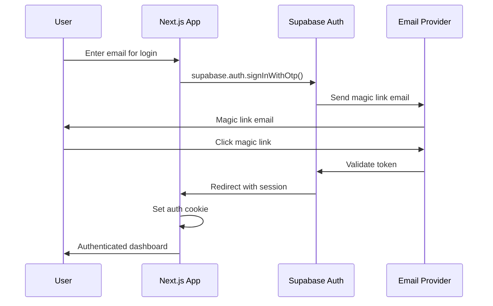

# Backend Architecture

## Service Architecture

### Function Organization

```
pages/api/
├── auth/
│   └── callback.ts         # Supabase auth callback
├── tasks/
│   ├── index.ts           # GET /api/tasks, POST /api/tasks
│   └── [id]/
│       ├── index.ts       # GET/PUT/DELETE /api/tasks/[id]
│       └── steps/
│           └── [stepId]/
│               └── complete.ts # POST /api/tasks/[id]/steps/[stepId]/complete
├── user/
│   └── stats.ts           # GET /api/user/stats
└── health.ts              # GET /api/health
```

### Function Template

```typescript
import { NextApiRequest, NextApiResponse } from "next";
import { createServerSupabaseClient } from "@supabase/auth-helpers-nextjs";
import { withAuth } from "@/lib/middleware/auth";

async function handler(req: NextApiRequest, res: NextApiResponse) {
  const supabase = createServerSupabaseClient({ req, res });

  try {
    switch (req.method) {
      case "GET":
        // Handle GET logic
        break;
      case "POST":
        // Handle POST logic
        break;
      default:
        res.setHeader("Allow", ["GET", "POST"]);
        res.status(405).end(`Method ${req.method} Not Allowed`);
    }
  } catch (error) {
    console.error("API Error:", error);
    res.status(500).json({
      error: "Internal server error",
      message: error instanceof Error ? error.message : "Unknown error",
    });
  }
}

export default withAuth(handler);
```

## Database Architecture

### Schema Design

```sql
-- Core tables as defined earlier in Database Schema section
-- Focus on simplicity with proper indexing

-- Additional helper functions
CREATE OR REPLACE FUNCTION update_user_streak()
RETURNS TRIGGER AS $$
BEGIN
  -- Update user's streak when task is completed
  IF NEW.status = 'completed' AND OLD.status != 'completed' THEN
    UPDATE public.users
    SET
      total_tasks_completed = total_tasks_completed + 1,
      streak_count = CASE
        WHEN last_active::date = CURRENT_DATE - INTERVAL '1 day'
        THEN streak_count + 1
        WHEN last_active::date = CURRENT_DATE
        THEN streak_count
        ELSE 1
      END,
      last_active = NOW()
    WHERE id = NEW.user_id;
  END IF;

  RETURN NEW;
END;
$$ LANGUAGE plpgsql;

CREATE TRIGGER update_streak_on_task_complete
  AFTER UPDATE ON public.tasks
  FOR EACH ROW
  EXECUTE FUNCTION update_user_streak();
```

### Data Access Layer

```typescript
import { SupabaseClient } from "@supabase/supabase-js";
import { Task, TaskStep, User } from "@/types";

export class TaskRepository {
  constructor(private supabase: SupabaseClient) {}

  async createTask(
    userId: string,
    title: string,
    breakdown: string[]
  ): Promise<Task> {
    // Insert task
    const { data: task, error: taskError } = await this.supabase
      .from("tasks")
      .insert({
        user_id: userId,
        title,
        ai_breakdown: breakdown,
      })
      .select()
      .single();

    if (taskError) throw taskError;

    // Insert task steps
    const steps = breakdown.map((step, index) => ({
      task_id: task.id,
      step_text: step,
      order_index: index,
    }));

    const { error: stepsError } = await this.supabase
      .from("task_steps")
      .insert(steps);

    if (stepsError) throw stepsError;

    return task;
  }

  async getUserTasks(userId: string): Promise<Task[]> {
    const { data, error } = await this.supabase
      .from("tasks")
      .select(
        `
        *,
        task_steps (*)
      `
      )
      .eq("user_id", userId)
      .order("created_at", { ascending: false });

    if (error) throw error;
    return data || [];
  }

  async completeStep(stepId: string): Promise<TaskStep> {
    const { data, error } = await this.supabase
      .from("task_steps")
      .update({
        completed: true,
        completed_at: new Date().toISOString(),
      })
      .eq("id", stepId)
      .select()
      .single();

    if (error) throw error;
    return data;
  }
}
```

## Authentication and Authorization

### Auth Flow



### Middleware/Guards

```typescript
import { NextApiRequest, NextApiResponse } from "next";
import { createServerSupabaseClient } from "@supabase/auth-helpers-nextjs";

export function withAuth(handler: Function) {
  return async (req: NextApiRequest, res: NextApiResponse) => {
    const supabase = createServerSupabaseClient({ req, res });

    const {
      data: { session },
      error,
    } = await supabase.auth.getSession();

    if (error || !session) {
      return res.status(401).json({
        error: "Unauthorized",
        message: "Valid session required",
      });
    }

    // Add user to request for convenience
    req.user = session.user;

    return handler(req, res);
  };
}

// Usage in API routes
export default withAuth(async (req: NextApiRequest, res: NextApiResponse) => {
  // req.user is now available and authenticated
  const userId = req.user.id;
  // ... rest of handler
});
```
