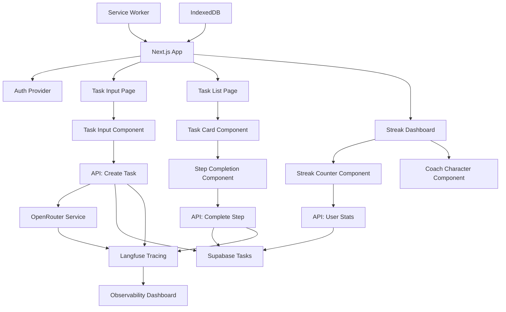

# Components

## Frontend App Component

**Responsibility:** Main React application with routing, auth state, and global providers

**Key Interfaces:**

- Authentication context provider
- Route protection and navigation
- Global state management setup

**Dependencies:** Next.js App Router, Supabase client, Zustand stores

**Technology Stack:** Next.js 14 App Router, TypeScript, Tailwind CSS

## Task Input Component

**Responsibility:** Text input interface for task creation with voice input support (future)

**Key Interfaces:**

- Task creation form with validation
- Loading states during AI processing
- Error handling and retry logic

**Dependencies:** OpenRouter API service, form validation library

**Technology Stack:** React components, Headless UI, form libraries

## Task Breakdown Display Component

**Responsibility:** Shows AI-generated micro-steps with interactive completion checkboxes

**Key Interfaces:**

- Step completion tracking
- Progress visualization
- Coach character integration

**Dependencies:** Task step data, completion API, animation library

**Technology Stack:** React, CSS animations, Tailwind

## Coach Character Component

**Responsibility:** Pixel-art companion providing encouragement and celebrations

**Key Interfaces:**

- State-based animations (idle, encouraging, celebrating)
- Context-aware messaging
- Celebration triggers

**Dependencies:** User progress data, animation assets

**Technology Stack:** CSS animations, SVG/pixel art assets

## API Route Handlers

**Responsibility:** Serverless functions handling OpenRouter integration, data persistence, auth

**Key Interfaces:**

- RESTful endpoints for CRUD operations
- OpenRouter API proxy with caching
- Authentication middleware

**Dependencies:** Supabase client, OpenRouter SDK, Redis cache

**Technology Stack:** Next.js API routes, TypeScript, serverless runtime

## Supabase Service Layer

**Responsibility:** Abstract database operations and real-time subscriptions

**Key Interfaces:**

- Repository pattern for data access
- Real-time change subscriptions
- Offline sync support

**Dependencies:** Supabase JavaScript client

**Technology Stack:** Supabase client libraries, PostgreSQL

## Langfuse Observability Service

**Responsibility:** Comprehensive AI/LLM call tracing, analytics, and debugging

**Key Interfaces:**

- Trace creation and lifecycle management
- Generation tracking with input/output capture
- Cost and performance metrics collection
- Real-time debugging and error tracking

**Dependencies:** Langfuse SDK, OpenRouter API responses, user session data

**Technology Stack:** Langfuse TypeScript SDK, observability dashboard

## Component Diagrams

