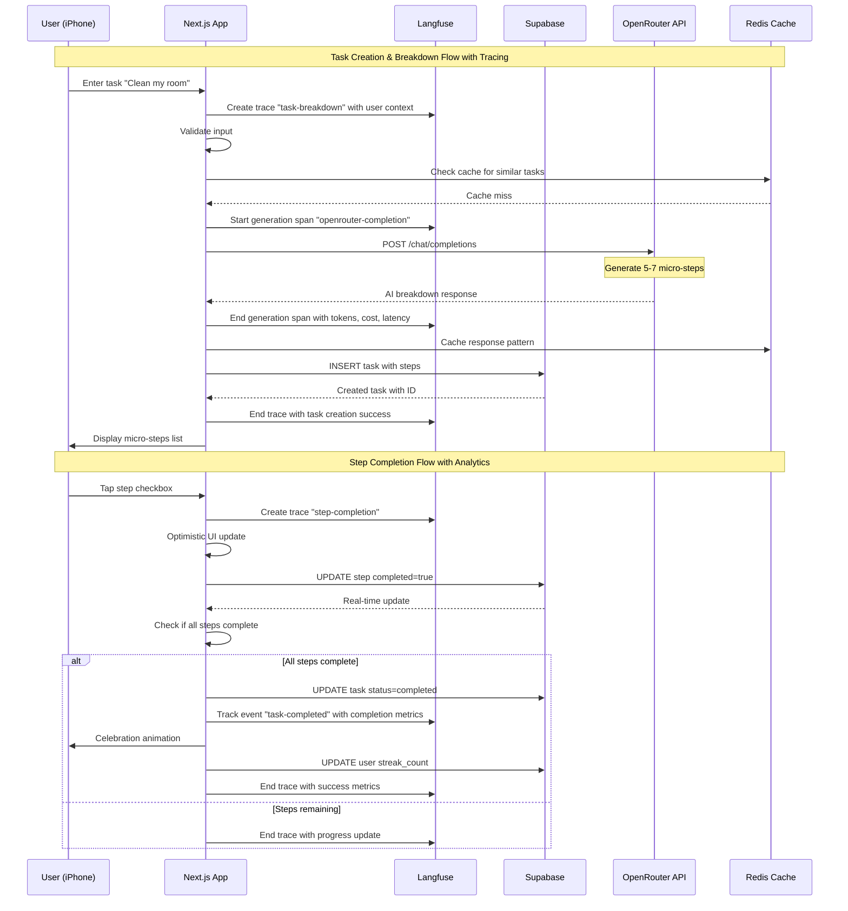

# Core Workflows

```mermaid
sequenceDiagram
    participant U as User (iPhone)
    participant A as Next.js App
    participant L as Langfuse
    participant S as Supabase
    participant O as OpenRouter API
    participant R as Redis Cache

    Note over U,R: Task Creation & Breakdown Flow with Tracing
    U->>A: Enter task "Clean my room"
    A->>L: Create trace "task-breakdown" with user context
    A->>A: Validate input
    A->>R: Check cache for similar tasks
    R-->>A: Cache miss
    A->>L: Start generation span "openrouter-completion"
    A->>O: POST /chat/completions
    Note over O: Generate 5-7 micro-steps
    O-->>A: AI breakdown response
    A->>L: End generation span with tokens, cost, latency
    A->>R: Cache response pattern
    A->>S: INSERT task with steps
    S-->>A: Created task with ID
    A->>L: End trace with task creation success
    A->>U: Display micro-steps list

    Note over U,R: Step Completion Flow with Analytics
    U->>A: Tap step checkbox
    A->>L: Create trace "step-completion"
    A->>A: Optimistic UI update
    A->>S: UPDATE step completed=true
    S-->>A: Real-time update
    A->>A: Check if all steps complete
    alt All steps complete
        A->>S: UPDATE task status=completed
        A->>L: Track event "task-completed" with completion metrics
        A->>U: Celebration animation
        A->>S: UPDATE user streak_count
        A->>L: End trace with success metrics
    else Steps remaining
        A->>L: End trace with progress update
    end
```
