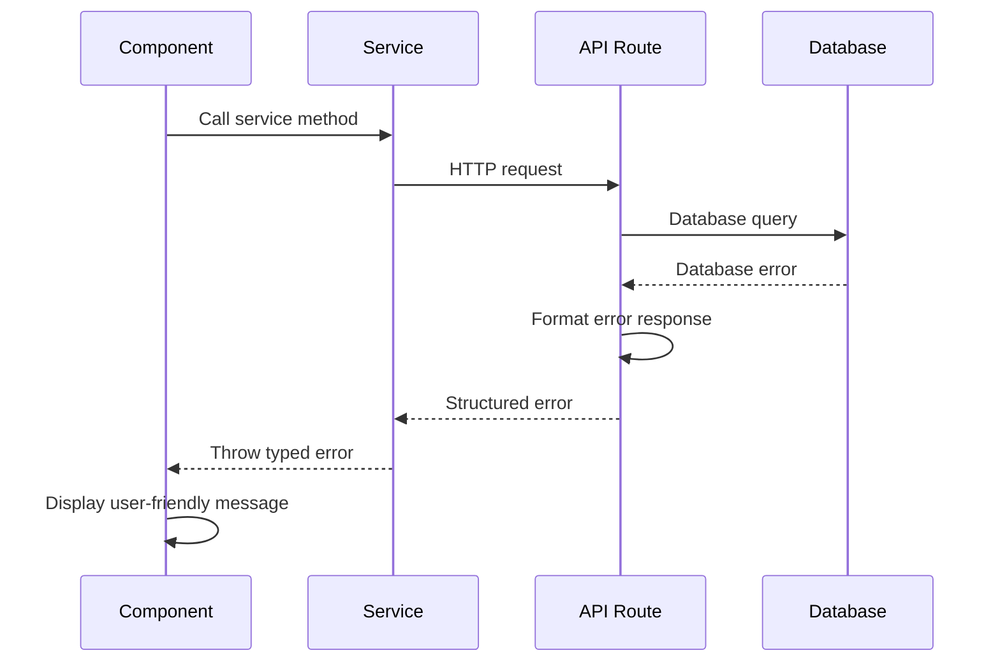

# Error Handling Strategy

## Error Flow



## Error Response Format

```typescript
interface ApiError {
  error: {
    code: string;
    message: string;
    details?: Record<string, any>;
    timestamp: string;
    requestId: string;
  };
}
```

## Frontend Error Handling

```typescript
import { toast } from "@/components/ui/toast";

export async function handleApiCall<T>(
  apiCall: () => Promise<T>,
  errorMessage = "Something went wrong"
): Promise<T | null> {
  try {
    return await apiCall();
  } catch (error) {
    console.error("API Error:", error);

    // Show user-friendly message
    toast.error(errorMessage);

    // Re-throw for component-specific handling
    throw error;
  }
}

// Usage in components
const handleCreateTask = async (title: string) => {
  await handleApiCall(
    () => taskService.createTask(title),
    "Failed to create task. Please try again."
  );
};
```

## Backend Error Handling

```typescript
export class ApiError extends Error {
  constructor(
    public statusCode: number,
    public code: string,
    message: string,
    public details?: any
  ) {
    super(message);
    this.name = "ApiError";
  }
}

export function withErrorHandling(handler: Function) {
  return async (req: NextApiRequest, res: NextApiResponse) => {
    try {
      return await handler(req, res);
    } catch (error) {
      console.error("API Route Error:", error);

      if (error instanceof ApiError) {
        return res.status(error.statusCode).json({
          error: {
            code: error.code,
            message: error.message,
            details: error.details,
            timestamp: new Date().toISOString(),
            requestId: req.headers["x-request-id"] || "unknown",
          },
        });
      }

      // Unexpected errors
      return res.status(500).json({
        error: {
          code: "INTERNAL_ERROR",
          message: "An unexpected error occurred",
          timestamp: new Date().toISOString(),
          requestId: req.headers["x-request-id"] || "unknown",
        },
      });
    }
  };
}
```
