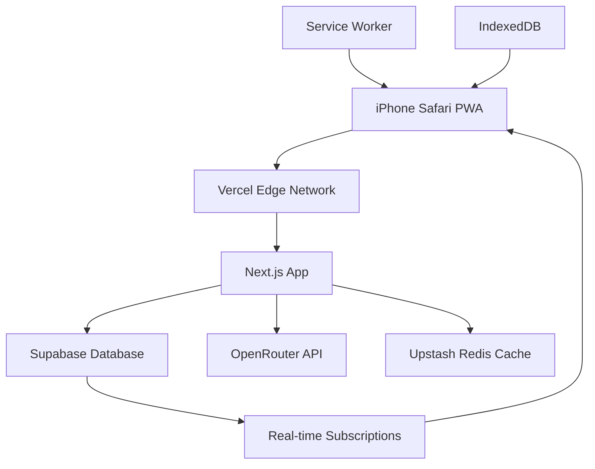

# High Level Architecture

## Technical Summary

Routiny uses a **serverless-first Next.js monolith** deployed on Vercel with Supabase as the complete backend service. The frontend leverages React 18 with TypeScript for type safety and Tailwind CSS for rapid UI development. API routes handle OpenRouter integration for task breakdown while Supabase provides authentication, real-time database, and offline sync. This architecture prioritizes developer experience and deployment simplicity over complex microservices, making it perfect for MVP development and learning.

## Platform and Infrastructure Choice

**Platform:** Vercel + Supabase
**Key Services:**

- Vercel (hosting, edge functions, deployments)
- Supabase (auth, database, real-time sync)
- OpenRouter API (task breakdown - access to multiple AI models)
- Upstash Redis (API response caching)

**Deployment Host and Regions:** Global edge network via Vercel with primary database in US-East

## Repository Structure

**Structure:** Monorepo with Next.js App Router
**Monorepo Tool:** Not needed - simple Next.js project structure
**Package Organization:** Single app with clear folder separation by feature

## High Level Architecture Diagram

## Architectural Patterns

- **Jamstack Architecture:** Static-first with serverless APIs - _Rationale:_ Maximum performance and simplicity for MVP
- **Component-Based UI:** Reusable React components with TypeScript - _Rationale:_ Maintainability and learning experience
- **Repository Pattern:** Abstract Supabase interactions - _Rationale:_ Clean separation and testability
- **API-First Design:** All data flows through defined APIs - _Rationale:_ Consistency and offline capability
